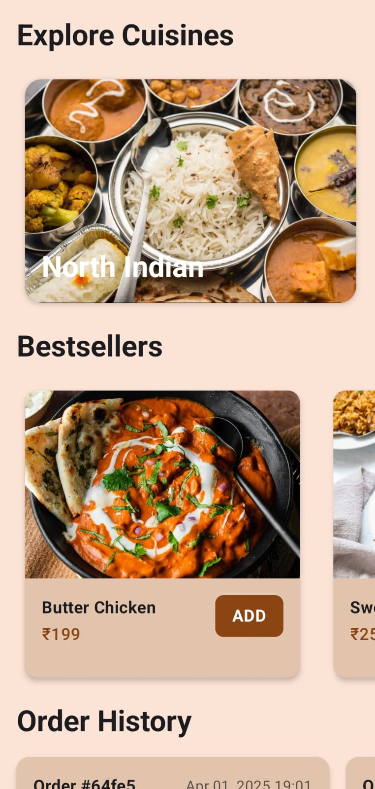
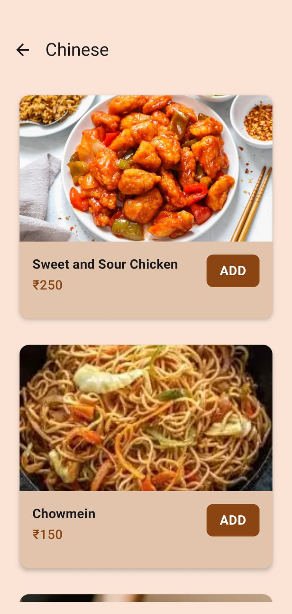
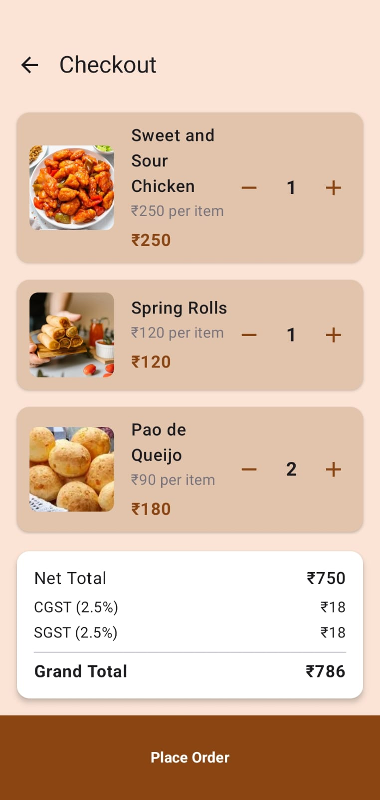

# Recipe App Oneblanc

A modern Android food ordering application built with Kotlin that offers a seamless experience for browsing and ordering food from various cuisines.

## App Screenshots

### Home Screen & Cuisines


_Explore various cuisines and bestseller items_

### Menu Items


_Browse through our delicious Chinese menu items_

### Cart & Checkout


_Easy checkout process with detailed price breakdown_

## Features

- **Multi-Cuisine Support**: Browse through different cuisine categories including:

  - Chinese
  - North Indian
  - And more...

- **Smart Cart System**:

  - Real-time cart updates
  - Quantity adjustment controls
  - Detailed price breakdown including taxes (CGST & SGST)
  - Grand total calculation

- **Menu Features**:

  - Categorized food items
  - Individual item pricing
  - High-quality food images
  - Easy "Add to Cart" functionality

- **Bestsellers Section**: Quick access to popular dishes

- **Order History**: Track past orders with timestamp

## Technical Specifications

### Built With

- Kotlin
- Android Material Design 3
- XML-based layouts with ConstraintLayout
- ViewBinding for view handling
- Clean Architecture principles

### Architecture

- Model-View-Intent (MVI) pattern
- Repository pattern for data management
- Navigation Component for screen navigation

### UI/UX Features

- Bottom Navigation
- Intuitive cart interface
- High-quality image rendering
- Responsive quantity controls
- Clean checkout process

### State Management

- Flow/LiveData for UI state management
- ViewModels for business logic

## Development Setup

### Prerequisites

- Android Studio Arctic Fox or later
- Kotlin 1.5.0 or later

### Installation

1. Clone the repository

```bash
git clone https://github.com/yourusername/RecipeAppOneblanc.git
```

2. Open the project in Android Studio
3. Sync Gradle files
4. Run the application

## Project Structure

```
app/
├── src/
│   ├── main/
│   │   ├── java/
│   │   │   └── com/example/recipeapponeblanc/
│   │   │       ├── ui/
│   │   │       ├── data/
│   │   │       ├── domain/
│   │   │       └── utils/
│   │   └── res/
│   └── test/
└── build.gradle
```

## Features in Development

- [ ] Online payment integration
- [ ] User authentication
- [ ] Order tracking
- [ ] Reviews and ratings
- [ ] Search functionality

## Contributing

Contributions are welcome! Please feel free to submit a Pull Request.

## License

[Your License Type]

## Contact

[Your Contact Information]
